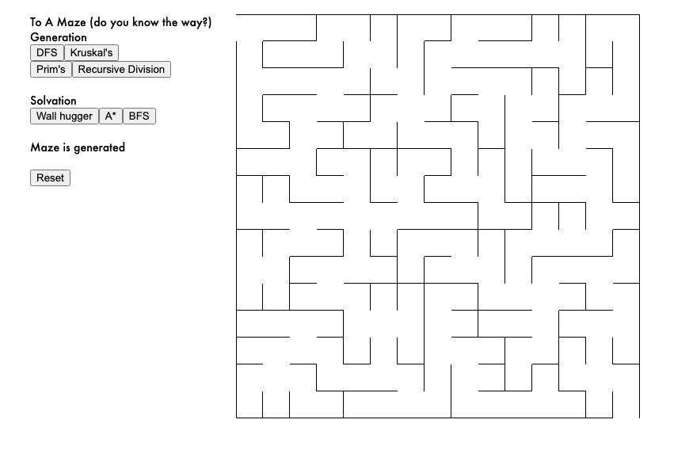
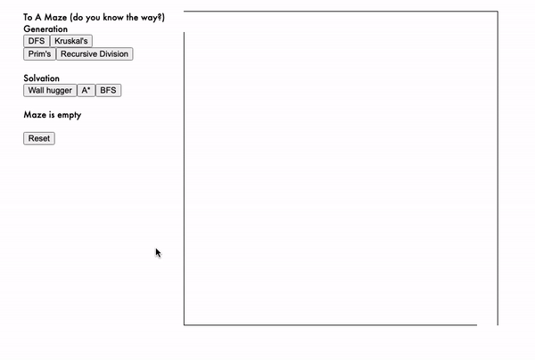

# To a maze (do you know the way?)

A simple [interactive demo](https://bqle.github.io/to-a-maze/) for the most prevalent maze-generating and maze-solving algorithms (including A*)!

## Description

This React app showcases the most popular maze-generating and maze-solving algorithms including DFS, Kruskal's, Prim's and recursive division for generation, and wall hugger (my favorite as a kid), A*, and BFS for solving. 
Each maze generation algorithm comes with its quirks. For instance, DFS will tend to have long corridors, Kruskal's will have short deadends, Prim's will be radial, and recursive division will have straight corridors. 
Each maze solving algorithm also comes with its strengths and weaknesses as well! Wall hugger is my favorite way to solve a maze because it is intuitive, but it only works for mazes that have 2 walls. A* and BFS are both fast, but they require an army of frontier soldiers. A* is especially good if you know the general direction of where you're going.
With this demo, you can try and see these algorithms in practice for yourself!

### Running the demo

* The maze will start as an empty, so generate the walls by choosing one of the genration options.
* Then, choose one of the solving algorithms in order to find a way through the maze.
* A fun challenge you can set for yourself is to see if you can spot a solution before the solving algorithm finishes!
* Press "reset" to clear the maze, and repeat!

## Demo

## Author

 [@Benjamin Le](bqle@seas.upenn.edu)

## Acknowledgments

* [Maze Generation](https://en.wikipedia.org/wiki/Maze_generation_algorithm)
* [Maze Solution](https://en.wikipedia.org/wiki/Maze-solving_algorithm)
